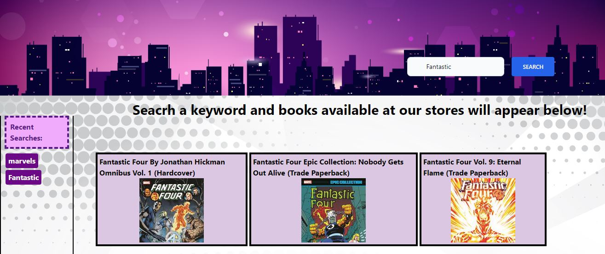

# Marvel Store

This dashboard lets a user find books/magazines available at the Marvel Store. When a user searches for a specific keyword from the magazine's title, it brings up the title of the magazines along with their thumbnails that contain that specific keyword. The application is built using HTML, Tailwind and JavaScript and retrieves data from the Marvel API.

# Screenshot

# Link to deploy the application

